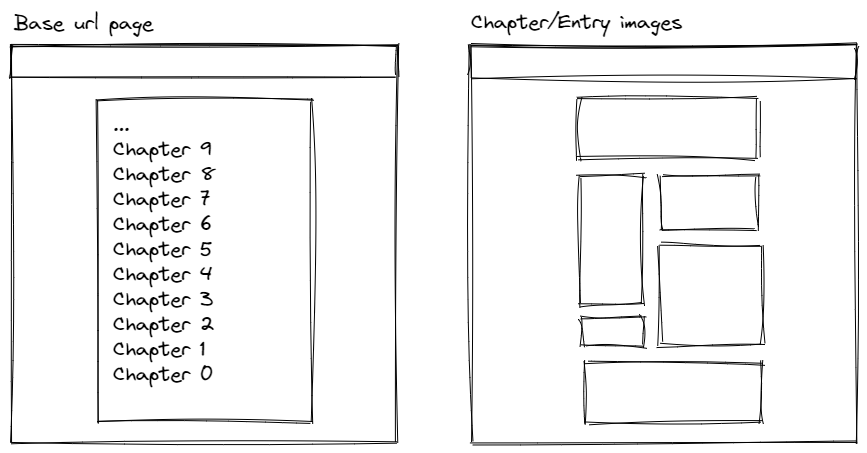

# Album scraper

Modularized python script for webscraping images

## Contents

1. [Description](#description)
1. [Motivation](#motivation)
1. [History](#history)
1. [How does it work?](#how-does-it-work)
   1. [Requirements](#requirements)
   1. [Installation](#installation)
1. [What pages does it work on?](#what-pages-does-it-work-on)
1. [Legal notice](#legal-notice)

## Description

[Back to the contents](#contents)

Scrape the images from a website into an album formatting (file wise).

It's not perfect, it's straight to the point.

## Motivation

[Back to the contents](#contents)

It's really annoying to keep downloading and organizing images you're downloading, for whatever that reason may be, and doing it all that work manually, too much mental overheat, what if you missed one image? how do you check it? they're unorganized by name, will you manually rename them? how many will you miss while doing so? and many more...

Why act like a robot when a robot can do it for you?

## History

[Back to the contents](#contents)

Started more than a year ago and I applied little modifications here and there, iterating, and finally decided to try and encapsulate it for module usage

## How does it work?

[Back to the contents](#contents)

You'll have to execute the `scrape` method at the moment, but module integration is not finished yet.

**_To be defined_**

### Requirements

[Back to the contents](#contents)

- Python 3.8.4 or higher
  - not tested on lower, but it should work on >= 3.6.x
- Some decent internet speed, It worked nicely on 20 MB/s

Libraries:

- Pip

Or manually install the following:

- shutil
- requests
- validators
- bs4

### Installation

[Back to the contents](#contents)

```bash
python -m pip install
# or pip3 install if you're on linux/unix systems
```

```bash
pip install -r requirements.txt # pip3 for any unix system
```

since python will be installed by default pip3

## What pages does it work on?

[Back to the contents](#contents)

Those without pagination, and with all the links you want to scrape visible at the homepage


_Page layouts, Image designed with [excalidraw](https://excalidraw.com/)_

## Legal notice

[Back to the contents](#contents)

I am not endorsing any illegal activities, images still hold their licensing and ownership but it's rightful author(s). If the robots.txt do not allow the officially legal webscraping of the website, any infrightful, mischiveous or illegal act will still be illegal, and not my reponsability.

Use this scripts at your own responsability.
