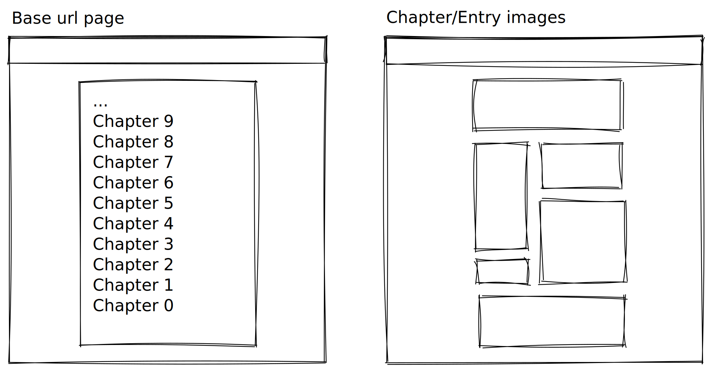

# Album scraper

## Description

Scrape the images from a website into an album formatting (file wise)

## History

Started more than a year ago and I applied little modifications here and there, iterating, and finally decided to try and encapsulate it for module usage

## How does it work?

You'll have to execute the `scrape` method at the moment, but module integration is not finished yet.

**_To be defined_**

### Requirements

- Python 3.8.4 or higher
  - not tested on lower, but it should work on >= 3.6.x
- Some decent internet speed, It worked nicely on 20 MB/s

Libraries:

- Pip

Or manually install the following:

- shutil
- requests
- validators
- bs4

### Installation

```bash
python -m pip install
# or pip3 install if you're on linux/unix systems
```

```bash
pip install -r requirements.txt # pip3 for any unix system
```

since python will be installed by default pip3

## What pages does it work on?

Those without pagination, and with all the links you want to scrape visible at the homepage


